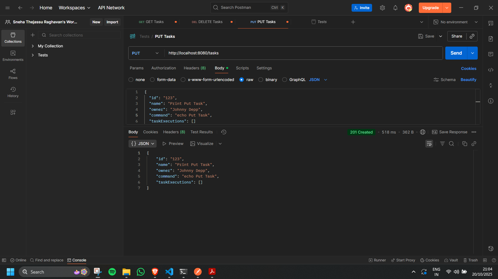

# kaiburr-task1-java

A RESTful API implementation using Spring Boot for managing tasks. It allows you to search, create, delete and execute tasks. This project was made for the Kaiburr assignment task 1.

# Features 

1. Create new tasks.
2. Get all tasks by ID.
3. Search for tasks by ID.
4. Execute tasks.
5. Delete tasks by ID.
6. Exception handling.

# Tech Stack

- Java 17 
- Spring Boot 3.5.6
- Maven
- MongoDB Atlas
- Postman (For API Testing)

# API Endpoints

| Method  | Endpoint                | Description                          | Request Body             | Response               |
|---------|-------------------------|--------------------------------------|--------------------------|------------------------|
| `GET`   | `/tasks`                | Get all tasks                        | -                        | 200 OK                 |
| `GET`   | `/tasks?id={id}`        | Get task by ID                       | -                        | 200 OK / 404 Not Found |
| `PUT`   | `/tasks`                | Create a new task                    | `TaskRequest` JSON       | 201 Created            |
| `DELETE`| `/tasks/{id}`           | Delete task by ID                    | -                        | 200 OK / 404 Not Found |
| `GET`   | `/tasks/search?name=`   | Search tasks by name                 | -                        | 200 OK                 |
| `PUT`   | `/tasks/{id}/execute`   | Execute a task                       | -                        | 200 OK                 |

# JSON Request Format

{
  "id": "111",
  "name": "Print Hello",
  "owner": "User1",
  "command": "echo Hello World!"
}

# How to Setup and Run 

- Clone the repository 

git clone https://github.com/Sneha-T-Raghavan/kaiburr-task1-java

- MongoDB Setup 
Update applications.properties with your mongodb uri connection string.

- Building and Compiling Locally 

1. cd task-java
2. mvn clean install
3. mvn spring-boot:run

The API will start at: http://localhost:8080

# Screenshots

Creating a Task

Get All Tasks

Get Task by ID

Deleting a Task

Executing a Task 

Mongo Database

